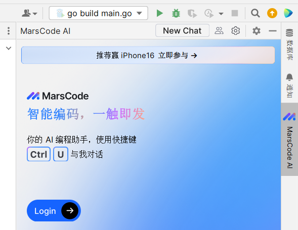
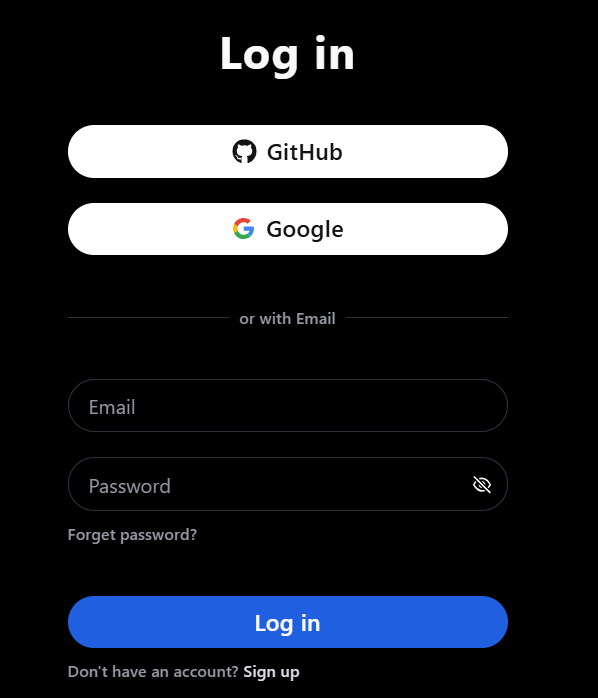
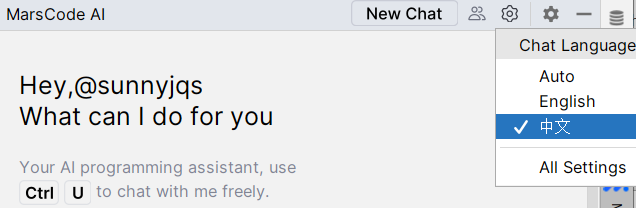

# MarsCode AI 插件安装、配置
## 1. MarsCode AI 插件下载
1. 文件>设置>插件>Marketplace>搜索MarsCode AI>安装

## 2. MarsCode AI 插件登陆
1. 点击Goland的右侧图标

2. 点击 Login 按钮登录，自动跳转到浏览器登陆界面，用户可以选择github、邮箱等多种登陆方式，登陆后，返回Goland的MarsCode AI界面，即可访问MarsCode AI的各种功能。

## 3. MarsCode AI 插件语言设置成中文
1. 点击 MarsCode AI 右上角的设置按钮，选择Chat Language，选择中文。

