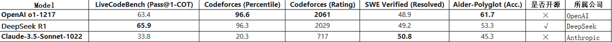
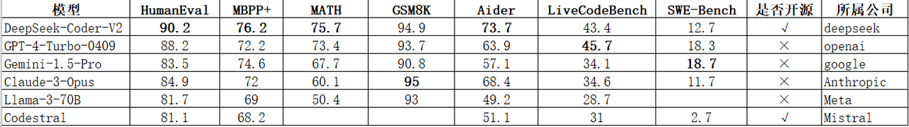

# AI 编程工具-总体介绍

## 1. 概述
随着人工智能技术的不断进步，AI大模型正逐渐成为科技领域的热点，尤其是在代码开发领域，AI编程工具正日益成为提升代码开发效率和确保代码质量的关键手段。因此，xw运行应用中心开发团队计划引入 AI 编程工具来提升开发团队的工作效率和质量，开发团队目前采用自主研发加外协的开发模式，开发团队的技术栈：前端主要采用Vue.js 框架，后端主要使用 Go 语言。通过使用 AI 编程工具，可以有效提升开发效率，并且自动化编写单元测试，有效把控外包人员的代码质量。

## 2. 需求和应用场景
1. 目前，许多大型科技公司正在积极采用大模型技术，以提升业务效率和创新能力。
- 中国市场： 截至2024年4月，中国的大模型数量已接近200个，其中通用大模型约40个。
- 全球市场： 全球人工智能大模型数量已达到1328个，中国占比约36%。
2. 许多大型科技公司正在积极采用大模型技术，并将其应用于软件开发和编程领域，以提高效率和创新能力。大厂在AI编程方面的应用：
- 谷歌： 谷歌CEO桑达尔·皮查伊透露，目前超过25%的新代码由 AI 生成。
- 百度： 百度表示，每天新增的代码中，有27%是由AI生成的。
- 阿里云： 阿里云内部开发的AI程序员“通义灵码”预计将负责20%的代码编写。

3. 在与外部协作人员共同开发代码时，AI编程工具可以在多个方面提升效率和质量，具体应用场景包括：
- 自动生成代码：AI 编程工具可提供代码自动补全、智能调试和代码审查等功能，帮助开发者快速编写和优化代码，提升效率。 
- 自动化测试：AI编程工具可以自动生成测试用例，提升测试效率，确保代码质量。
- 自动生成代码注释：AI 编程工具能够自动生成代码注释，显著提升了代码的可读性和可维护性。
- 自动生成技术方案：1. 对于已有代码仓库，可以根据代码生成技术方案；2. 对于新的需求，可以根据需求生成技术方案
## 3. AI 大模型的编程能力调研
1. DeepSeek 系列模型 在开源模型中位列榜首，与世界上最先进的闭源模型不分伯仲。
- DeepSeek R1

- DeepSeek-Coder-V2

### 3.1 大模型基准测试
下面提到的所有的大模型基准测试数据集都可以在 Huggingface 上查看到。
- 示例：**[HumanEval](https://huggingface.co/datasets/openai/openai_humaneval)**
#### 3.1.1 HumanEval
1. HumanEval (Human Evaluation)人工评估，是由OpenAI开发的广泛使用的代码生成基准测试。它包含164个由OpenAI工程师手动编写的编程任务，涵盖从简单的字符串操作到复杂的算法设计等多种编程任务。每个任务包括一个函数签名、注释、主体和几个单元测试。这些任务旨在评估大型语言模型在代码生成方面的能力。
2. 示例：编写一个函数，接受字符串，如果字符串长度为素数则返回 True，否则返回 False。
3. 在评估过程中，模型需要根据给定的提示生成代码，并通过预设的测试用例来验证其正确性。评估指标通常使用pass@k来衡量，即在k次尝试中至少有一次生成正确代码的概率。 
#### 3.1.2 MBPP+
MBPP（Mostly Basic Programming Problems）增强版和HumanEval一样，也是用于评估大模型代码生成能力的数据集。主要包含了974个短小的Python函数问题，由谷歌在2021年推出，这些问题主要是为初级程序员设计的。 数据集还包含了这些程序的文本描述和用于检查功能正确性的测试用例。
#### 3.1.3 GSM8K
GSM-8K (Grade School Math)，即小学数学，GSM8K 由 8.5K 高质量的小学数学问题组成，这些问题都是由人类写手创造的。我们将这些问题分为 7.5K 训练问题和 1K 测试问题。这些问题需要 2 到 8 个步骤来解决，解决方法主要是使用基本的算术运算`（+ - / *）`进行一连串的基本计算，以得出最终答案。一个聪明的中学生应该能够解决每个问题。众所周知，数学运算是所有大模型能力最弱的部分。GSM8K数据集就是专门用来评估大模型数学运算能力的。
#### 3.1.4 Aider
1. Aider 可让您将程序与 LLM 配对，以编辑本地 git 存储库中的代码。开始新项目或使用现有代码库。Aider 最适合与 Claude 3.5 Sonnet、DeepSeek R1 & Chat V3、OpenAI o1、o3-mini 和 GPT-4o 配合使用。Aider 可以连接到几乎任何 LLM，包括本地模型。**[Aider LLM Leaderboards](https://aider.chat/docs/leaderboards/)**，提供了一个独特的基准系统，用于评估语言模型在代码编辑任务中的编辑能力。这个工具通过专门评估这些模型在集成新代码和重构现有代码方面的能力而脱颖而出。
2. Aider-Polyglot（Acc.）：Aider-Polyglot：是指一个多语言编程任务的评估基准。Acc.（Accuracy，准确率）：表示模型正确解决问题的比例。
#### 3.1.5 LiveCodeBench
1. LiveCodeBench，是一个旨在为LLMs提供全面、实时、无污染评估的平台。大多数人使用OpenAI的HumanEval，但一些模型似乎会过度拟合到这个基准。它打破了传统框架的限制，不仅实时收集来自LeetCode、AtCoder、CodeForces等竞赛平台的新问题，还超越了简单的代码生成，涵盖自修复、代码执行乃至测试输出预测等更广泛的代码能力场景。截至最近，项目囊括了四百个高质量编码挑战，构成了一个动态而全面的基准测试库。
2. LiveCodeBench（Pass@1-COT）：Pass@1：指模型在首次尝试时成功解决问题的比例。COT（Chain-of-Thought）：链式推理，指模型在解答过程中展示其推理过程的中间步骤，而不仅仅是给出最终答案。Pass@1-COT：结合了首次尝试通过率和链式推理的评估指标，要求模型在首次尝试时成功解决问题，并展示合理的推理过程。
#### 3.1.6 SWE-Bench
1. SWE-Bench(Software Engineering Benchmarks) 是一个用于评估 LLM 解决 GitHub 上真实软件问题能力的基准测试数据集。它收集了来自 12 个流行的 Python 仓库的 2,294 个 Issue-Pull Request 对。在测试时，LLM 会拿到一个代码库和 issue 描述，然后生成一个补丁来解决 issue 描述的问题。
2. SWE-Bench Verified（Resolved）。OpenAI 指出原始的 SWE-bench 存在一些问题，可能导致模型的自主软件工程能力被低估。因此，在改进过程中，他们与 SWE-Bench 原作者合作，进行了人工筛选和改进，确保单元测试的范围适当且问题描述明确。在 SWE-bench Verified 上进行的新测试中，很多 AI 编程智能体的得分都比原来要高。OpenAI 认为，这证明之前的基准确实存在低估 AI 编程能力的缺陷。Resolved（已解决）：表示模型成功解决问题的比例。
#### 3.1.7 Codeforces（Rating）
Codeforces 是俄国的算法竞赛网站，作为全世界最强的算法竞赛平台，Codeforces 使用 Rating（评分）来衡量选手水平。每个人都有一定的初始 Rating。改变 Rating 的主要方式为标准 Codeforces 比赛，一场比赛结束后，Codeforces Rating System 会根据所有参赛选手的现有 Rating 和比赛排名来计算每位选手 Rating 变化值，以体现出比赛中选手的发挥水平。

## 4. 初步计划安排
### 4.1. 编写 AI 编程学习网站
  1. vscode 下载、安装、常见场景使用说明
  2. vscode golang 配置
  3. vscode 配置 deepseek 说明
  4. 自动生成代码演示
  5. 自动生成代码注释演示
  6. 自动生成mbse等流程图
  7. 常见问题解答：收集并解答团队在使用AI编程工具时常遇到的问题，提供解决方案。比如如何免费使用cursor。
  8. 收集用户反馈，持续改进：通过问卷调查、座谈会等方式收集团队成员的反馈意见，持续优化AI编程工具的使用体验。
### 4.2. 培训、推广
  1. 在运行应用中心组织AI培训：定期举办AI编程工具的培训课程，提升团队成员的技能水平。
  2. 建立DeepSeek使用交流微信群，方便实时反馈：创建专门的微信群，方便团队成员交流使用心得，及时解决使用中的问题。
### 4.3. 自研XW AI 编程软件
  1. 调研开源的AI编程软件，自研 XW AI 编程软件.
  2. 解决自动测试的功能，研制xw特色的ide编程工具，持续优化AI编程体验，提升 XW 开发团队的工作效率。
  3. 市面上大多ai 编程插件都需要注册，甚至上传代码数据，为了保护 XW 数据隐私，需要自研。
  4. 市面上大多软件都是收费的，自研可以免费。
  5. 有一些开源的版本，可以作为参考。

## 5. 总结
随着人工智能技术的迅猛发展，AI编程工具在提升开发效率和代码质量方面展现出巨大的潜力。通过自动化代码生成、智能调试、代码审查等功能，开发者能够更高效地编写和优化代码。此外，AI编程工具还可自动生成测试用例和代码注释，显著提高代码的可读性和可维护性。
在市场层面，AI编程工具的应用场景广泛，涵盖了代码自动生成、智能调试、代码审查、自动化测试等多个方面。根据IDC的预测，到2030年，AI将为全球经济带来19.4万亿美元的经济收益，其中包括直接价值链收益和间接全生态影响。 
在中国市场，AI代码生成工具的应用也在快速增长。根据弗若斯特沙利文联合头豹研究院发布的《中国AI代码生成市场报告》，预计到2028年将增长至330亿元人民币，年均增长率为38.4%。 
综上所述，AI编程工具在提升开发效率、确保代码质量和降低开发成本方面具有重要意义。随着技术的不断进步，预计其在软件开发领域的应用将更加广泛和深入。